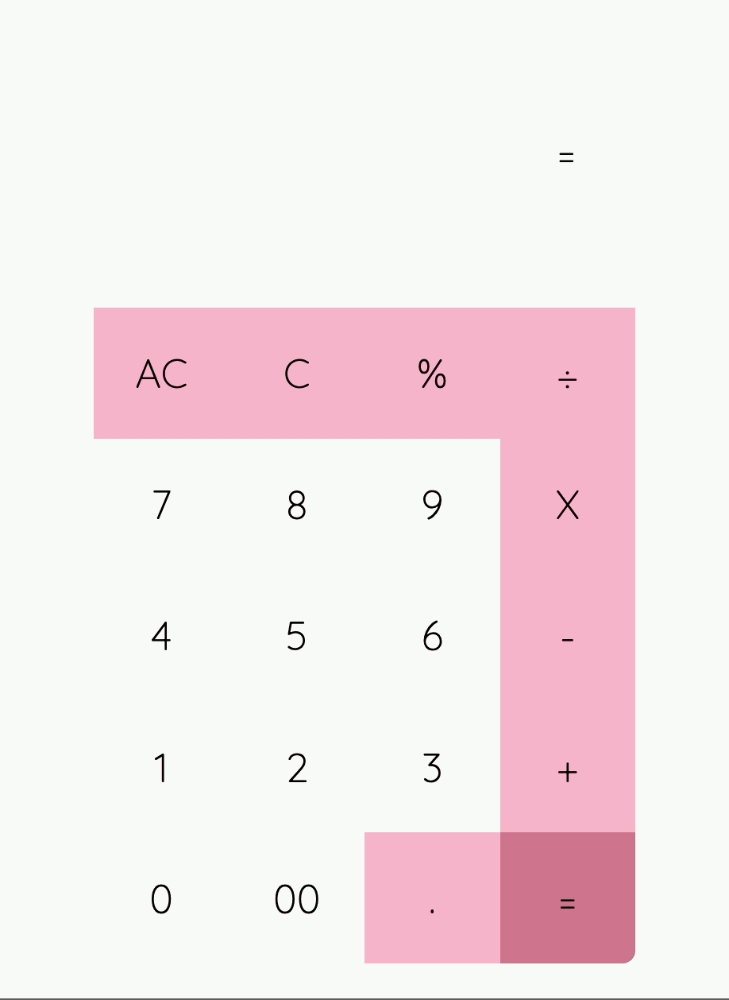

# calculator

## <a href="https://oh-calculator.netlify.app/index2" target="_blank">Live Demo</a>

a simple calculator 
 
at the moment the calculator is just able to compute with 2 numbers, you can still insert multiple numbers, but it wouldn't be calculated in the right order



## technologies used 
* Vuejs
* Flexbox / CSS Grid

## Setup
``` shell
$ git clone https://github.com/OliviaHelmuth/calculator.git
$ cd calculator
$ npm install
```